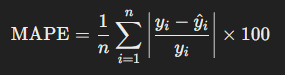
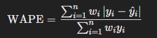
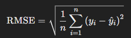
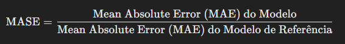

# 📊 Previsão de Estoque Inteligente na AWS com SageMaker Canvas - Meu Projeto

## 🎯 Objetivos Deste Desafio de Projeto (Lab)

## 🚀 Passo a Passo

### 1. Selecionar Dataset

Para o desenvolvimento desse projeto, foi utilizado o dataset [dataset-1000-com-preco-variavel-e-renovacao-estoque.csv](datasets/dataset-1000-com-preco-variavel-e-renovacao-estoque.csv) que continha dados variaveis e com uma precisão mais verdadeira dos perceintis.

### 2. Construir/Treinar

-   Após a importação do arquivo no SageMaker e seleção das variaveis de entrada e sainda é nos dado dois caminhos para treinar a ML que ira nos ajudar com os dados, neste projeto foi utilizado o mais rapido e menos preciso, para fins didáticos. 

### 3. Analisar

-   Realizado o treinamento do ajudante, nos é apresentado um diagrama com dados e perceintis com modelaos otimistas, pessimistas e medianos para termos uma insight para a previsão.

### 4. Prever

-   Por fim, temos dados estruturados prontos para analisarmos o que poderá acontecer se tal situação que coloquemos la altere a previsão, de facil acesso, prático e com uma automatização de um processo que antes seria trabalhoso e poderia conter diversos erros.

# Curiosidades 💡

Os modelos de ML (Machine Learning) apresentam algumas siglas que são sempre motivo de analise e estudos entre os cientistas de dados, vamos dar uma olhada nelas abaixo!

### 1. Avg wQl (Average Weighted Quality)

    *Definição: Esta métrica é uma forma de medir a qualidade média ponderada das previsões do modelo.
    O "weighted" geralmente indica que diferentes observações têm diferentes níveis de importância ou "peso"  
    na avaliação da qualidade.

Seu uso pode ser para entender o desempenho geral do modelo, levando em conta a importância relativa das previsões.

### 2. MAPE (Mean Absolute Percentage Error)
    *Definição: O MAPE mede o erro absoluto médio em termos percentuais.
    É calculado como a média das diferenças absolutas entre as previsões e os valores reais, 
    divididas pelos valores reais e multiplicadas por 100.onde 𝑦𝑖 é o valor real,
    𝑦^𝑖 é o valor previsto e n é o número total de observações.
    

Ela é útil para entender a precisão das previsões em termos percentuais, especialmente quando os valores reais variam em escala.

### 3. WAPE (Weighted Absolute Percentage Error)
    *Definição: O WAPE é uma variação do MAPE que leva em consideração pesos associados às observações.
    É calculado como a soma dos erros absolutos ponderados, dividida pela soma dos valores reais ponderados 
    onde 𝑤𝑖 é o peso associado à i-ésima observação.

Útil em contextos onde diferentes observações têm diferentes importâncias ou frequências.

### 4. RMSE (Root Mean Squared Error)
    *Definição: O RMSE é a raiz quadrada da média dos erros quadráticos.
    Mede a magnitude média dos erros em um modelo preditivo.

Serve para entender a dispersão dos erros das previsões em relação aos valores reais, com erros maiores tendo um impacto desproporcional devido ao quadrado.

### 5. MASE (Mean Absolute Scaled Error)
    *Definição: O MASE é uma métrica que compara o erro absoluto médio do modelo
    com o erro absoluto médio de um modelo de referência (geralmente um modelo de "no-change" ou de previsão simples).
    É calculado como:

Compara o desempenho do modelo com uma linha de base e avalia se o modelo está realmente oferecendo melhorias significativas em relação a uma abordagem simples.
